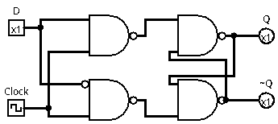
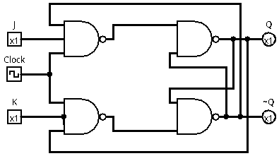

# Flip Flop D e JK

Os flip-flops são circuitos sequenciais usados para armazenar um bit de informação. Diferente dos circuitos combinacionais, suas saídas dependem não apenas das entradas atuais, mas também do estado anterior. Eles mudam de estado de forma controlada por um sinal de clock, o que garante comportamento síncrono e previsível. São amplamente utilizados em registradores, memórias e contadores digitais.

## Flip Flop D

O flip-flop D, também conhecido como Data ou Delay, é o tipo mais simples de flip-flop. Ele possui uma única entrada de dado e um clock, e sua função é copiar o valor da entrada D para a saída Q a cada pulso de clock. Dessa forma, o flip-flop D atua como uma pequena célula de memória que armazena o valor lógico presente na entrada no momento do pulso.

## Flip Flop JK

O flip-flop JK é uma evolução do flip-flop SR, resolvendo o problema do estado inválido. Ele possui duas entradas, J e K, e uma entrada de clock. Dependendo das combinações dessas entradas, o flip-flop JK pode manter, setar, resetar ou inverter o estado atual da saída. Essa versatilidade o torna muito útil em aplicações como contadores binários e circuitos de controle lógico.

