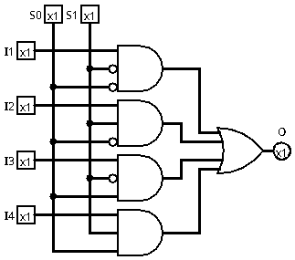

# Multiplexador 4x1

Um multiplexador 4x1 é um circuito combinacional que seleciona uma entre quatro entradas de dados e a encaminha para a saída, de acordo com os valores de duas entradas de seleção. Ele funciona como um "comutador eletrônico", permitindo que várias fontes compartilhem um único canal de saída.

O multiplexador 4x1 possui quatro entradas de dados, duas entradas de seleção e uma saída. Dependendo da combinação das entradas de seleção, apenas uma das entradas de dados é transmitida para a saída, enquanto as demais são ignoradas. Esse tipo de circuito é amplamente utilizado em sistemas digitais para roteamento de sinais e economia de recursos, permitindo controlar múltiplas informações com poucas linhas de saída.

