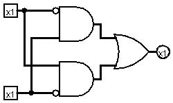

# XOR

A porta XOR (ou OU exclusivo) é um circuito lógico que produz saída igual a 1 apenas quando o número de entradas em nível lógico alto é ímpar. Em sua forma mais comum, com duas entradas, a XOR retorna 1 quando as entradas são diferentes e 0 quando são iguais.

Essa porta é muito utilizada em operações aritméticas, como somadores binários, e em aplicações de comparação e controle lógico, pois sua função essencial é indicar diferença entre sinais.

