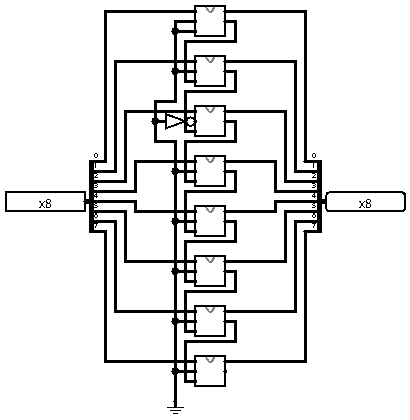
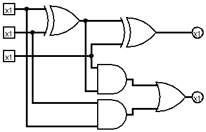

# Somador de 8 bit que soma com 4

Um somador que utiliza 8 somadores completos e realiza a soma do valor de entrada com 4.

# Somador Completo

O full adder somador completo é um circuito combinacional usado para realizar a soma de três bits: duas entradas de dados e um bit de transporte (carry-in) proveniente de uma soma anterior. Ele produz dois resultados, a soma e o carry-out, que representa o bit de transporte para a próxima posição de maior peso.

Esse circuito é essencial em sistemas aritméticos digitais, pois permite encadear vários full adders para formar somadores de múltiplos bits, como em processadores e unidades lógicas e aritméticas (ULA).

