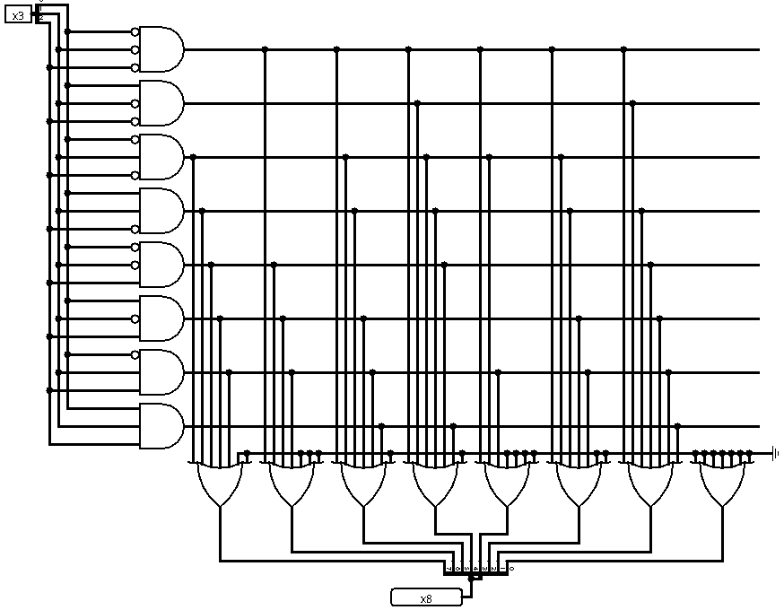

# Memória ROM

A memória ROM (Read-Only Memory) é um tipo de memória não volátil, ou seja, que mantém os dados armazenados mesmo sem energia elétrica. Ela é projetada para armazenar informações permanentes, como firmware, tabelas fixas ou instruções que não mudam durante a execução do sistema.

Diferente da RAM, o conteúdo da ROM é definido durante a fabricação ou programação inicial e não pode ser modificado durante o uso normal. Por isso, é amplamente utilizada em sistemas embarcados, bootloaders e dispositivos que necessitam de instruções fixas para inicialização.

