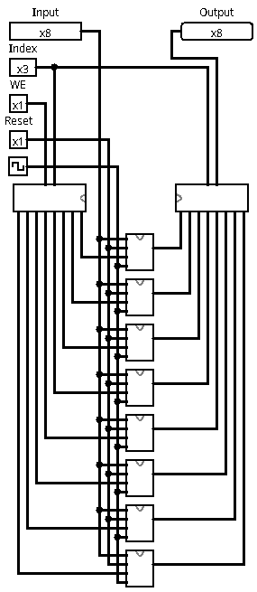
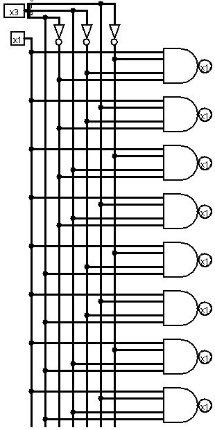
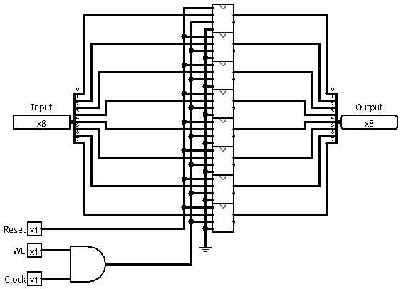
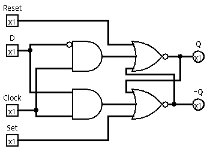

# Memória RAM

A memória RAM (Random Access Memory) é um tipo de memória volátil utilizada para armazenar temporariamente dados e instruções enquanto o processador executa tarefas. Ela permite acesso aleatório a qualquer posição de memória com a mesma velocidade, o que torna o processamento rápido e eficiente.

Diferente da ROM, o conteúdo da RAM é perdido quando o sistema é desligado, sendo usada apenas durante a operação do computador ou circuito. É amplamente empregada em sistemas digitais para armazenar variáveis, pilhas, buffers e dados intermediários de processamento.

## Demultiplexador

O circuito apresentado utiliza de um demultiplexador onde recebe 3 bits de entrada e retorna 8 bits de saída para poder acessar cada célula de memória correspondente ao index de 3 bits.

## Registrador

A memória RAM utiliza 8 registradores de 8 bits cada como células de memória.

Cada registrador contém 8 instancias de um D flip-flop para para registrar os 8 bits.

