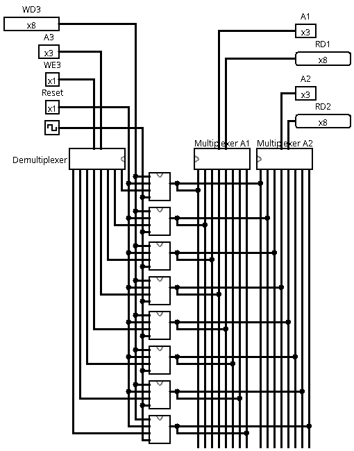

# Banco de Registradores

Um banco de registradores de 8 bits com 8 registradores é um conjunto de oito registradores independentes, cada um capaz de armazenar uma palavra de 8 bits. Ele funciona como uma pequena memória de acesso extremamente rápido dentro do processador, usada para guardar dados temporários, resultados de operações e endereços.

O acesso aos registradores é controlado por sinais de seleção que determinam qual registrador será lido ou escrito. Um multiplexador é usado para escolher qual registrador envia seus dados para a saída, enquanto um demultiplexador direciona o sinal de escrita para o registrador correto. Esse tipo de estrutura é fundamental na arquitetura de processadores, pois permite operações rápidas sem depender da memória principal.

