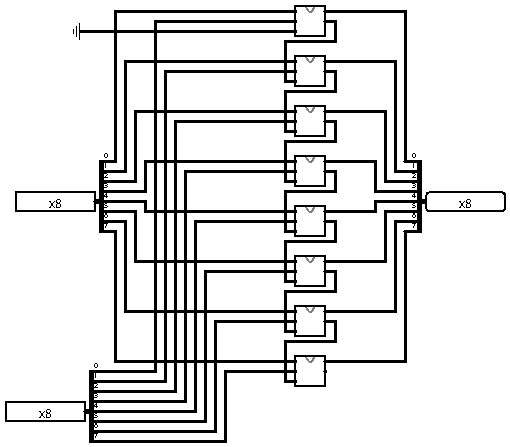

# Somador de 8 bits

O somador de 8 bits é um circuito aritmético usado para realizar a adição binária de dois números de 8 bits. Ele é formado pela conexão em série de oito full adders, onde o carry-out de cada bit menos significativo é ligado ao carry-in do bit seguinte, permitindo o transporte entre as posições.

Esse tipo de somador é essencial em unidades lógicas e aritméticas (ULA), processadores e sistemas digitais em geral, possibilitando operações de soma entre bytes completos. Em alguns casos, o somador também gera sinais auxiliares, como o carry final (transporte de saída) e o overflow, indicando estouro de capacidade na operação.

